# Specification Driven Development for a Virtual Assistant to help solve the NYT Connections Puzzle

This is a testbed for using specification driven development (SDD) to create a virtual assistant that can help users solve the NYT Connections puzzle.

The SDD approach involves writing detailed specifications for the desired behavior of the virtual assistant, and then using those specifications to guide the development process. This allows for a more structured and systematic approach to development, ensuring that the final product meets the user's needs and expectations.

Demonstration of the virtual assistant can be found in this [YouTube video](https://youtu.be/SI92EEvwtVI?t=1308).

The SDD process is based on Github's [spec-kit framework](https://github.com/github/spec-kit).

This work is based on an earlier [Virtual Assistant](https://github.com/jimthompson5802/connection_solver).

## Quick Start

### Prerequisites
- Python 3.11+ with virtual environment
- Node.js 18+ with npm
- Git
- LLM provider credentials (OpenAI API key or local Ollama)

### Setup & Run

1. **Clone and Navigate**
   ```bash
   git clone <repository-url>
   cd sdd_connection_solver2
   ```

2. **Backend Setup**
   ```bash
   cd backend
   python -m venv .venv
   source .venv/bin/activate  # On Windows: .venv\Scripts\activate
   pip install -e .
   ```

3. **Configure LLM Provider**
   ```bash
   # For OpenAI (recommended)
   export OPENAI_API_KEY="sk-proj-your-api-key"

   # OR for local Ollama
   ollama serve  # In separate terminal
   ollama pull llama2  # Pull a supported model
   ```

4. **Start Backend**
   ```bash
   cd backend
   source .venv/bin/activate
   export PYTHONPATH=src
   uvicorn src.main:app --reload --host 127.0.0.1 --port 8000
   ```

5. **Start Frontend (new terminal)**
   ```bash
   cd frontend
   npm install
   npm start
   ```

6. **Access Application**
   - Open http://localhost:3000
   - Backend API docs: http://localhost:8000/docs

## Features

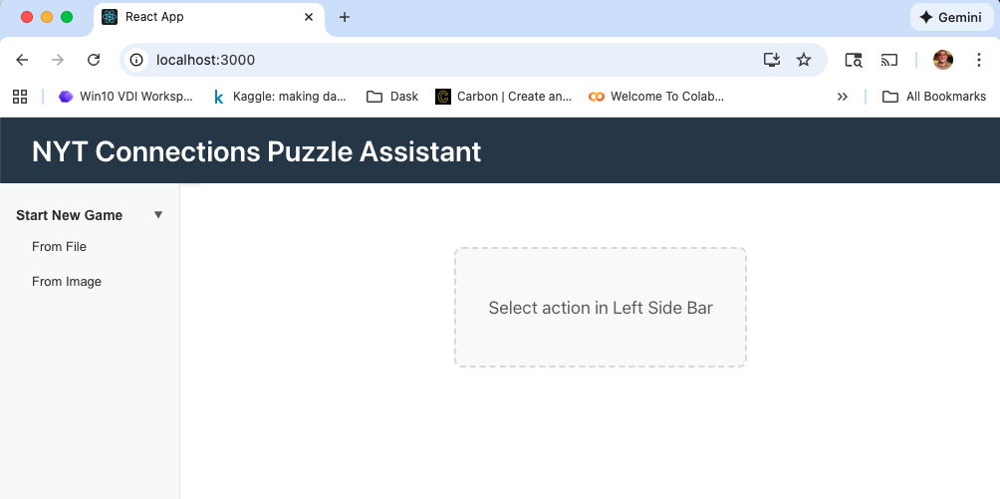

### 1. File-Based Puzzle Setup
Upload CSV files containing NYT Connections puzzle data:
- Navigate to "From File" in the sidebar
- Upload a CSV file with 16 words
- Get AI-powered solving recommendations

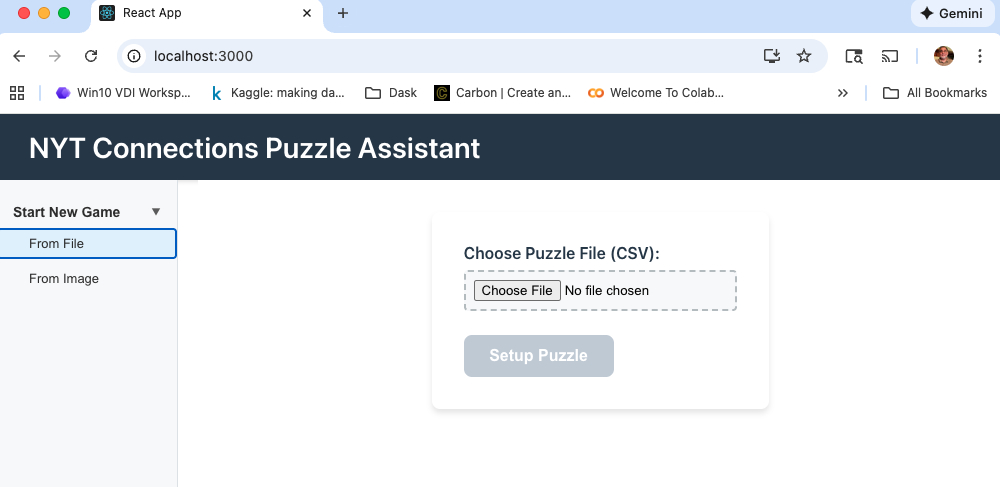
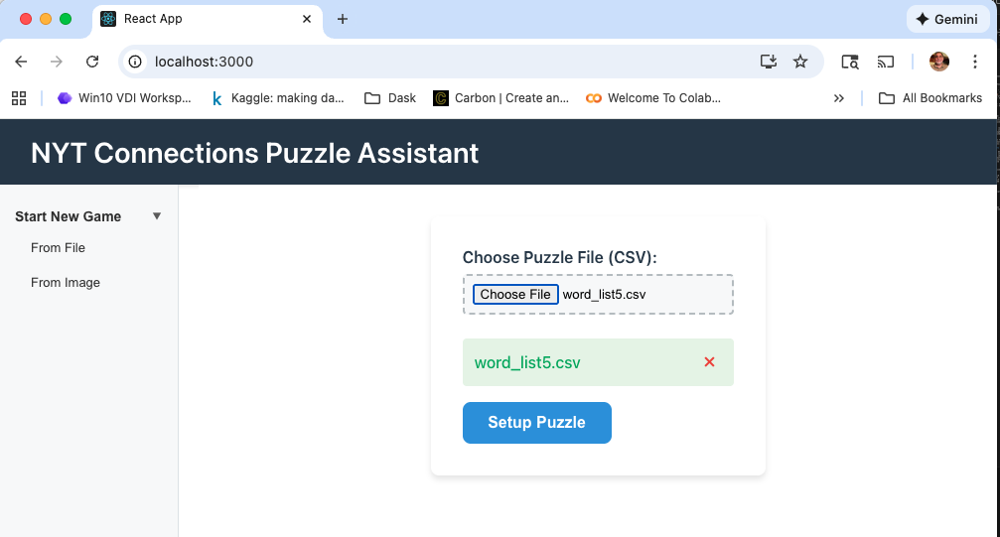

### 2. Image-Based Puzzle Setup ✨ NEW
Take screenshots of puzzle grids and extract words using AI vision:
- Navigate to "From Image" in the sidebar
- Paste an image of a 4x4 word grid (Ctrl+V / Cmd+V)
- Select your LLM provider and vision model
- Click "Setup Puzzle" to extract words and start solving

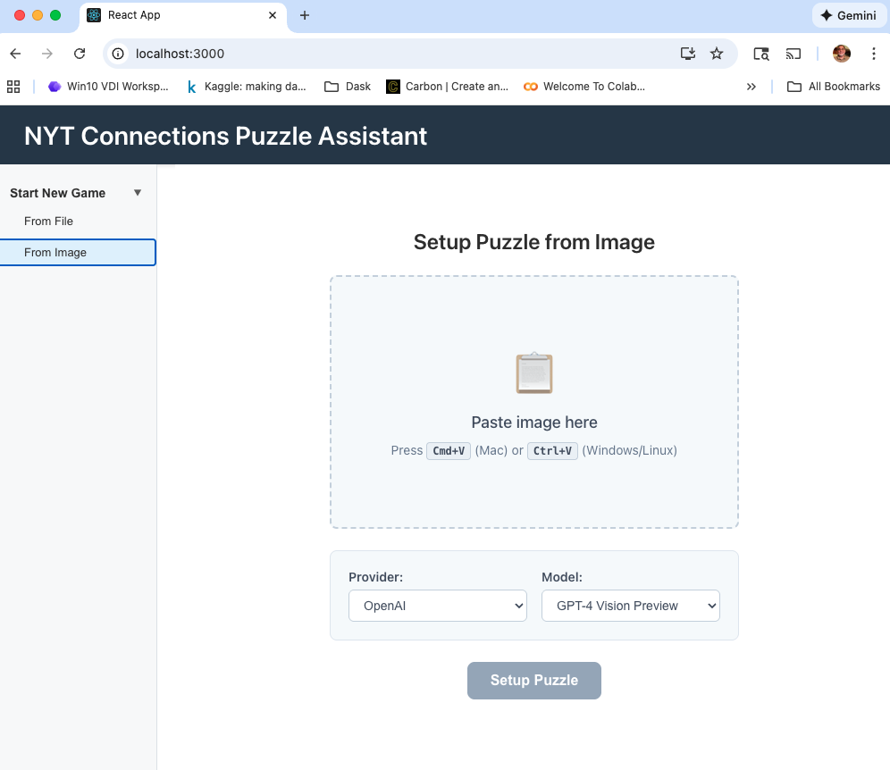
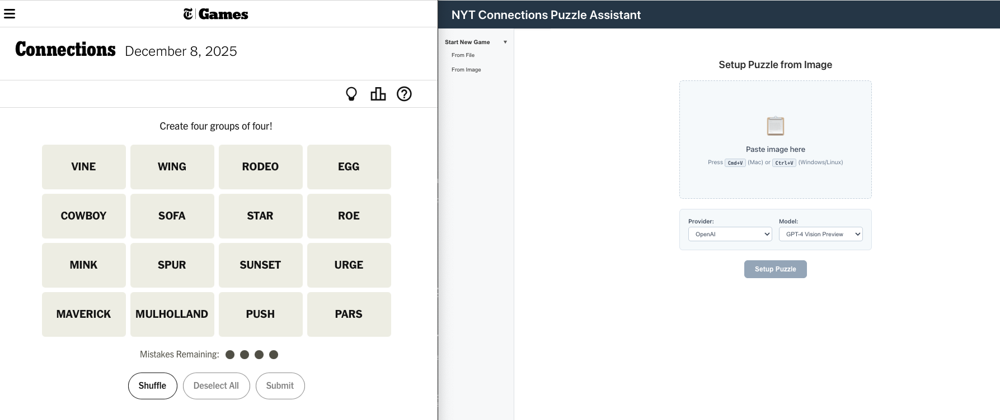
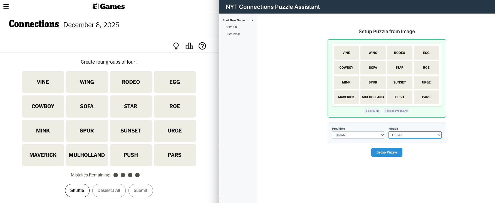
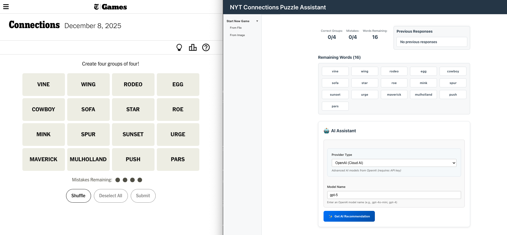
#### Supported Image Sources
- Screenshots of NYT Connections puzzles
- Photos of printed puzzle grids
- Any clear 4x4 word layout

#### Vision Model Requirements
- **OpenAI**: GPT-4 Vision, GPT-4 Turbo, GPT-4o
- **Ollama**: llava models (local inference)
- **Image formats**: PNG, JPEG, JPG, GIF
- **Size limit**: 5MB maximum

### 3. AI-Powered Solving
- Multiple LLM provider support (OpenAI, Ollama, Simple)
- Semantic analysis of word relationships
- Group suggestions with confidence scores
- Hint generation and explanation


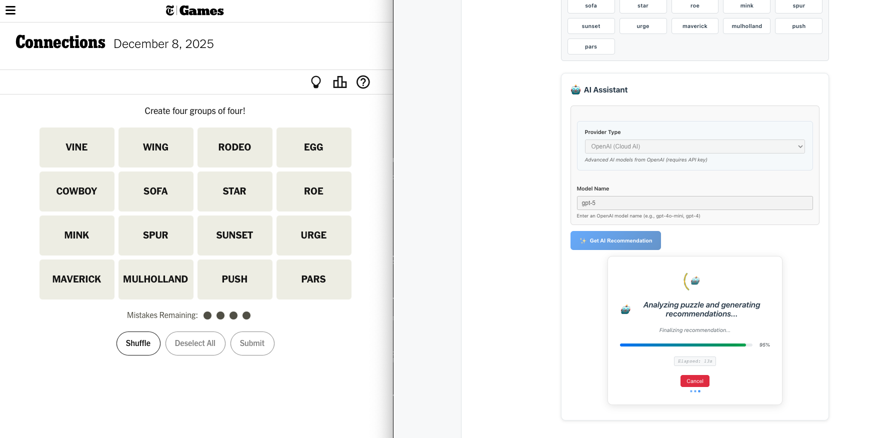
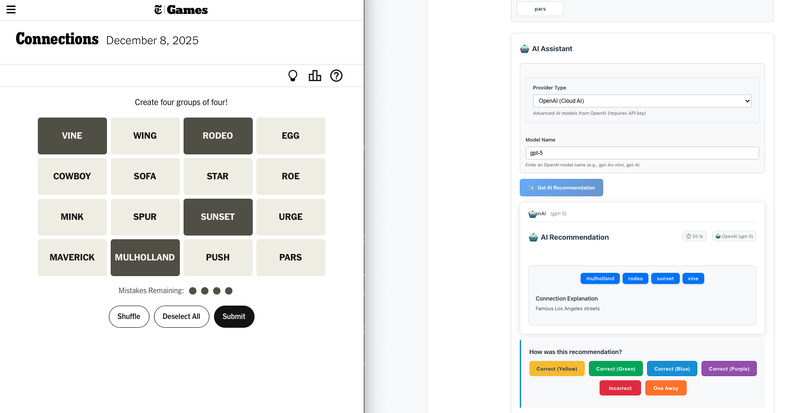
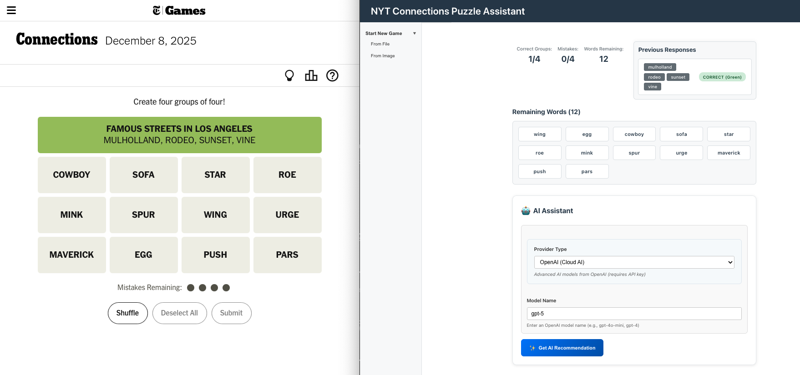
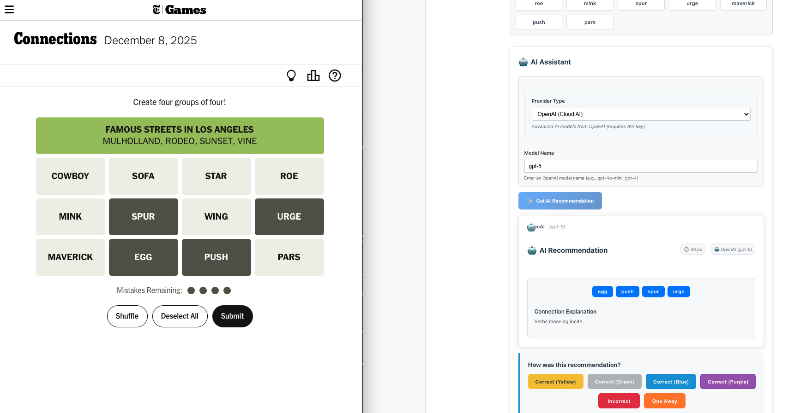
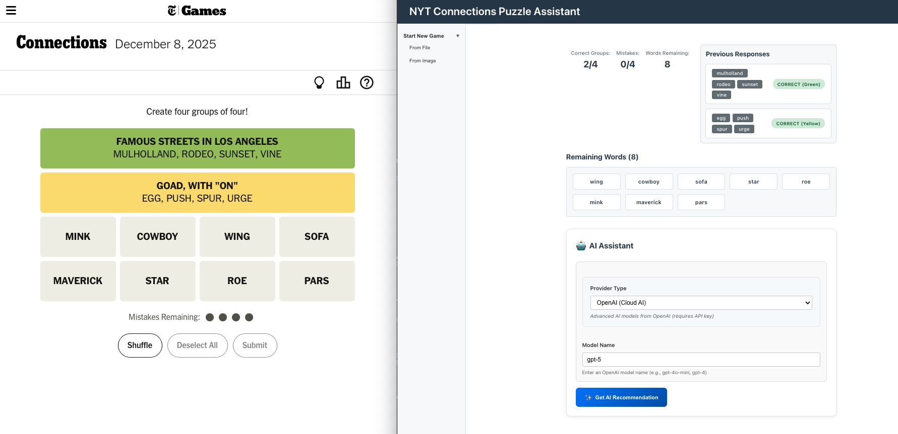
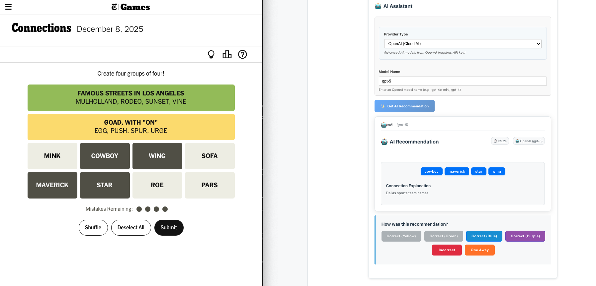
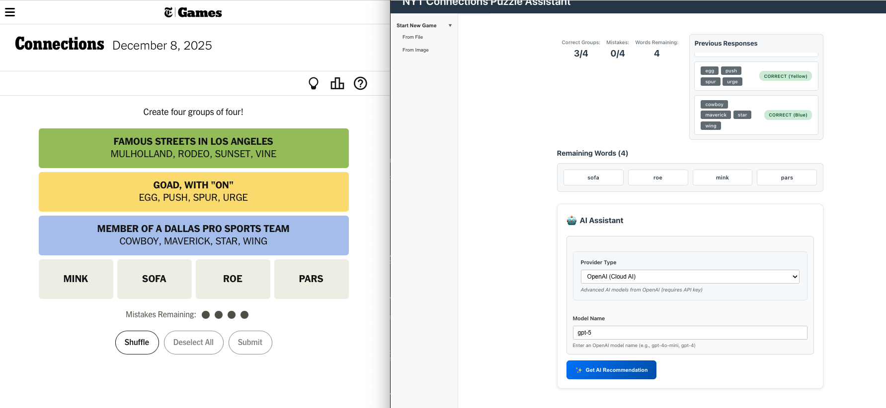
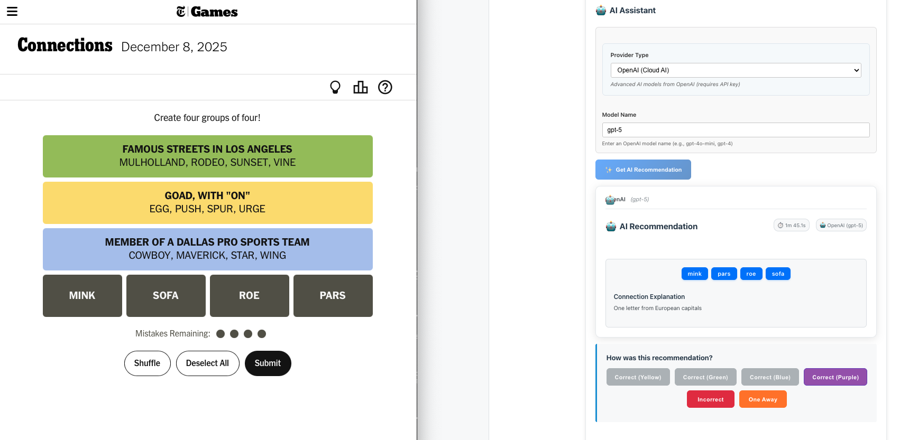
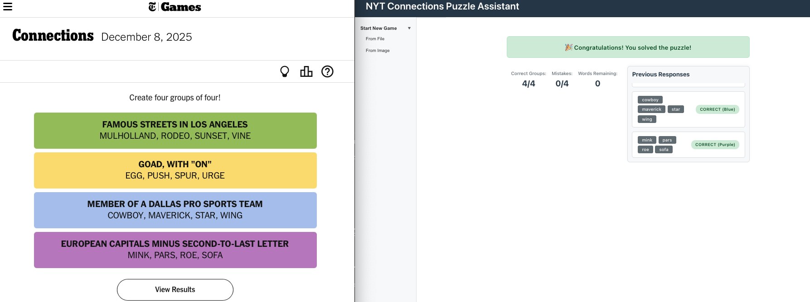


## Testing

### Run All Tests
```bash
# Backend tests
cd backend
source .venv/bin/activate
pytest

# Frontend tests
cd frontend
npm test
```

### Generate Test Coverage Report
```bash
# Backend
cd backend
source .venv/bin/activate
pytest --cov=src --cov-report=html:htmlcov tests/

# open report
open

# Frontend
cd frontend
CI=true npm test -- --coverage --watchAll=false

# open report
open frontend/coverage/lcov-report/index.html
```


### Image Feature Testing
```bash
# Test with sample images (requires vision-capable LLM)
cd frontend
npm test -- --testPathPattern=ImagePuzzleSetup
```

## Architecture

- **Backend**: FastAPI + Python with LangChain for LLM integration
- **Frontend**: React + TypeScript with modern hooks
- **Storage**: In-memory session management (single-user)
- **LLM Integration**: Provider-agnostic factory pattern
- **Image Processing**: Client-side base64 encoding + server-side LLM vision

## Configuration

### Environment Variables
```bash
# Required for OpenAI provider
OPENAI_API_KEY=sk-proj-your-key-here

# Optional for Ollama (defaults to localhost:11434)
OLLAMA_BASE_URL=http://localhost:11434

# Optional API configuration
API_BASE_URL=http://localhost:8000
```

### Supported Browsers
- Chrome 66+ (recommended)
- Firefox 63+
- Safari 13.1+
- Edge 79+

*Note: Clipboard API required for image paste functionality*

## Development

This project uses specification-driven development (SDD) with the spec-kit framework. New features go through:

1. **Specification** (`specs/*/spec.md`) - User requirements and acceptance criteria
2. **Planning** (`specs/*/plan.md`) - Technical implementation plan
3. **Implementation** (`specs/*/tasks.md`) - Detailed task breakdown
4. **Testing** - TDD approach with >80% coverage requirement

See `specs/` directory for detailed feature specifications and development guides.

## Troubleshooting

### Common Issues

**Image paste not working**
- Ensure modern browser (Chrome 66+, Firefox 63+, Safari 13.1+)
- Check browser clipboard permissions
- Verify image format (PNG/JPEG/JPG/GIF only)

**LLM extraction failing**
- Verify API key configuration: `echo $OPENAI_API_KEY`
- Check model supports vision (GPT-4 Vision, not GPT-3.5)
- Ensure image shows clear 4x4 word grid

**Backend startup issues**
```bash
cd backend
source .venv/bin/activate
export PYTHONPATH=src
python -c "from src.main import app; print('Import successful')"
```

**Frontend build issues**
```bash
cd frontend
rm -rf node_modules package-lock.json
npm install
npm start
```

For detailed troubleshooting, see `specs/004-image-puzzle-setup/quickstart.md`.
