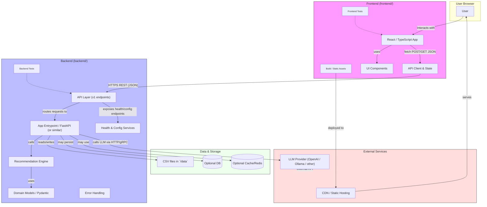

%% Mermaid architecture diagram for sdd_connection_solver2
%% Render with a Mermaid-aware previewer (e.g., VS Code Mermaid preview)

Legend:
- `Frontend` — code in `frontend/` (React/TS). Communicates with backend via REST JSON endpoints (e.g., `/api/v1/*`).
- `Backend` — code in `backend/` (Python). Implements API routes, recommendation engine, model validation, health and config services.
- `Data` — local CSVs in `data/` or an optional DB/cache for persistent/session state.
- `External` — third-party LLMs and hosting/CDN used for static assets.

Notes & Integration Points:
- Frontend builds static assets (`frontend/build`) which can be served by a CDN or the backend's static file server.
- The front-end API client in `frontend/src` talks to the backend API (`/api/v1`) using JSON.
- Backend may call external LLM providers via `llm_provider_factory` or similar modules; treat those calls as network-external and mock in tests.
- Tests live under `frontend/tests` and `backend/tests`; maintain CI steps to run both.
