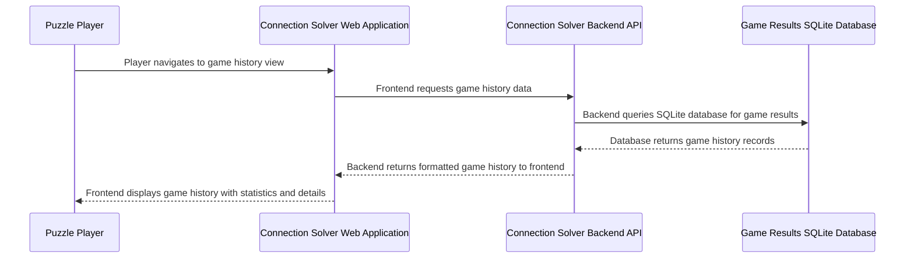

## Details

| Field               | Value                    |
|---------------------|--------------------------|
| **Unique ID**       | game-history-retrieval-flow                   |
| **Name**            | Game History Retrieval Process                 |
| **Description**     | User requests and views historical game results with optional CSV export functionality          |

## Sequence Diagram

## Controls
    _No controls defined._

## Metadata
  

      <table>
          <thead>
          <tr>
              <th>Key</th>
              <th>Value</th>
          </tr>
          </thead>
          <tbody>
          <tr>
              <td>
                  <b>Business Process</b>
              </td>
              <td>
                  Game History Analysis
                      </td>
          </tr>
          <tr>
              <td>
                  <b>User Journey Step</b>
              </td>
              <td>
                  5-Review-History
                      </td>
          </tr>
          <tr>
              <td>
                  <b>Api Endpoint</b>
              </td>
              <td>
                  GET /api/v2/game_results
                      </td>
          </tr>
          <tr>
              <td>
                  <b>Export Format</b>
              </td>
              <td>
                  JSON, CSV (via ?format&#x3D;csv query parameter)
                      </td>
          </tr>
          <tr>
              <td>
                  <b>Display Features</b>
              </td>
              <td>
                  Pagination, filtering, sorting, CSV download
                      </td>
          </tr>
          </tbody>
      </table>
  

