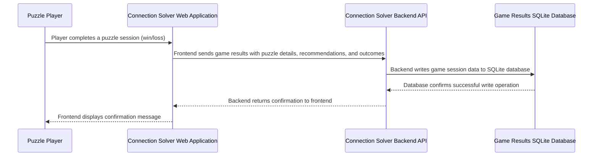

## Details

| Field               | Value                    |
|---------------------|--------------------------|
| **Unique ID**       | game-results-recording-flow                   |
| **Name**            | Game Results Recording Process                 |
| **Description**     | System persists completed game session data to database for historical tracking and analysis          |

## Sequence Diagram

## Controls
    _No controls defined._

## Metadata
  

      <table>
          <thead>
          <tr>
              <th>Key</th>
              <th>Value</th>
          </tr>
          </thead>
          <tbody>
          <tr>
              <td>
                  <b>Business Process</b>
              </td>
              <td>
                  Game Results Persistence
                      </td>
          </tr>
          <tr>
              <td>
                  <b>User Journey Step</b>
              </td>
              <td>
                  4-Complete-Game
                      </td>
          </tr>
          <tr>
              <td>
                  <b>Api Endpoint</b>
              </td>
              <td>
                  POST /api/v2/game_results
                      </td>
          </tr>
          <tr>
              <td>
                  <b>Database Table</b>
              </td>
              <td>
                  game_results
                      </td>
          </tr>
          <tr>
              <td>
                  <b>Stored Data</b>
              </td>
              <td>
                  session_id, puzzle_date, words, recommendations, responses, final_status, timestamps
                      </td>
          </tr>
          </tbody>
      </table>
  

