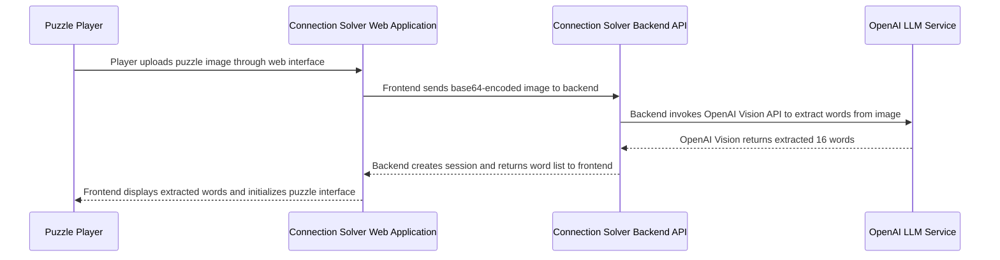

## Details

| Field               | Value                    |
|---------------------|--------------------------|
| **Unique ID**       | image-puzzle-setup-flow                   |
| **Name**            | Image-Based Puzzle Setup Process                 |
| **Description**     | User uploads an image of a puzzle grid and LLM vision capabilities extract the 16 words          |

## Sequence Diagram

## Controls
    _No controls defined._

## Metadata
  

      <table>
          <thead>
          <tr>
              <th>Key</th>
              <th>Value</th>
          </tr>
          </thead>
          <tbody>
          <tr>
              <td>
                  <b>Business Process</b>
              </td>
              <td>
                  Image-Based Setup
                      </td>
          </tr>
          <tr>
              <td>
                  <b>User Journey Step</b>
              </td>
              <td>
                  1-Setup-Alternative
                      </td>
          </tr>
          <tr>
              <td>
                  <b>Api Endpoint</b>
              </td>
              <td>
                  POST /api/v2/setup_puzzle_from_image
                      </td>
          </tr>
          <tr>
              <td>
                  <b>Llm Capability</b>
              </td>
              <td>
                  Vision API
                      </td>
          </tr>
          <tr>
              <td>
                  <b>Image Format</b>
              </td>
              <td>
                  base64-encoded, JPEG/PNG
                      </td>
          </tr>
          <tr>
              <td>
                  <b>Success Criteria</b>
              </td>
              <td>
                  16 words extracted from 4x4 grid
                      </td>
          </tr>
          </tbody>
      </table>
  

