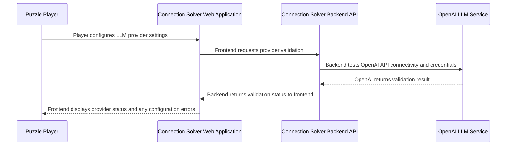

## Details

| Field               | Value                    |
|---------------------|--------------------------|
| **Unique ID**       | provider-validation-flow                   |
| **Name**            | LLM Provider Validation Process                 |
| **Description**     | System validates LLM provider configuration and availability before generating recommendations          |

## Sequence Diagram

## Controls
    _No controls defined._

## Metadata
  

      <table>
          <thead>
          <tr>
              <th>Key</th>
              <th>Value</th>
          </tr>
          </thead>
          <tbody>
          <tr>
              <td>
                  <b>Business Process</b>
              </td>
              <td>
                  Provider Configuration
                      </td>
          </tr>
          <tr>
              <td>
                  <b>User Journey Step</b>
              </td>
              <td>
                  0-Setup
                      </td>
          </tr>
          <tr>
              <td>
                  <b>Api Endpoint</b>
              </td>
              <td>
                  POST /api/v2/providers/validate
                      </td>
          </tr>
          <tr>
              <td>
                  <b>Validation Checks</b>
              </td>
              <td>
                  API key, connectivity, model availability
                      </td>
          </tr>
          </tbody>
      </table>
  

