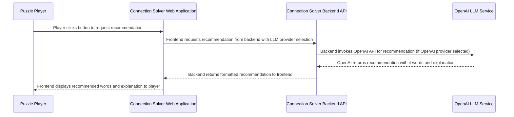

## Details

| Field               | Value                    |
|---------------------|--------------------------|
| **Unique ID**       | recommendation-generation-flow                   |
| **Name**            | AI Recommendation Generation Process                 |
| **Description**     | User requests AI-powered word grouping recommendations from selected LLM provider          |

## Sequence Diagram

## Controls
    _No controls defined._

## Metadata
  

      <table>
          <thead>
          <tr>
              <th>Key</th>
              <th>Value</th>
          </tr>
          </thead>
          <tbody>
          <tr>
              <td>
                  <b>Business Process</b>
              </td>
              <td>
                  Recommendation Generation
                      </td>
          </tr>
          <tr>
              <td>
                  <b>User Journey Step</b>
              </td>
              <td>
                  2-Get-Recommendation
                      </td>
          </tr>
          <tr>
              <td>
                  <b>Api Endpoints</b>
              </td>
              <td>
                  GET /api/puzzle/next_recommendation, POST /api/v2/recommendations
                      </td>
          </tr>
          <tr>
              <td>
                  <b>Llm Providers</b>
              </td>
              <td>
                  OpenAI, Ollama, Simple
                      </td>
          </tr>
          <tr>
              <td>
                  <b>Success Criteria</b>
              </td>
              <td>
                  4 words returned with connection explanation
                      </td>
          </tr>
          </tbody>
      </table>
  

