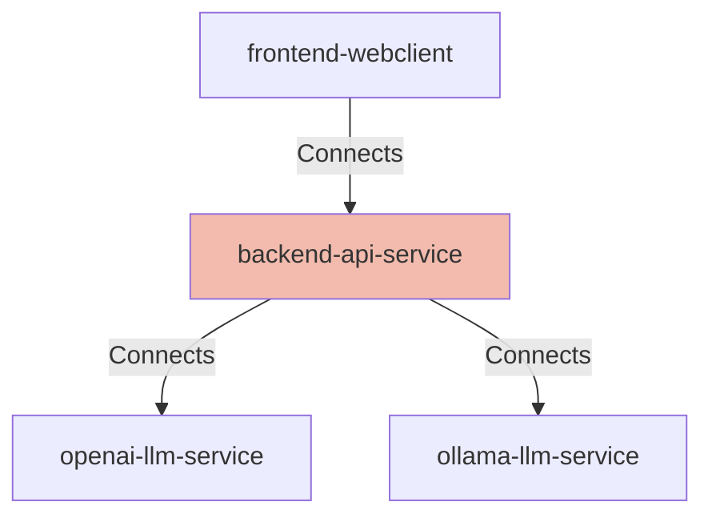

## Details

| Field               | Value                    |
|---------------------|--------------------------|
| **Unique ID**       | backend-api-service                   |
| **Node Type**       | service             |
| **Name**            | Connection Solver Backend API                 |
| **Description**     | FastAPI-based REST API service that orchestrates puzzle solving, manages game sessions, and integrates with LLM providers for generating recommendations          |

## Interfaces
    _No interfaces defined._

## Related Nodes

## Controls
    _No controls defined._

## Metadata
  

      <table>
          <thead>
          <tr>
              <th>Key</th>
              <th>Value</th>
          </tr>
          </thead>
          <tbody>
          <tr>
              <td>
                  <b>Technology</b>
              </td>
              <td>
                  FastAPI
                      </td>
          </tr>
          <tr>
              <td>
                  <b>Language</b>
              </td>
              <td>
                  Python 3.11+
                      </td>
          </tr>
          <tr>
              <td>
                  <b>Framework</b>
              </td>
              <td>
                  Uvicorn
                      </td>
          </tr>
          <tr>
              <td>
                  <b>Testing</b>
              </td>
              <td>
                  pytest, mypy
                      </td>
          </tr>
          <tr>
              <td>
                  <b>Validation</b>
              </td>
              <td>
                  Pydantic
                      </td>
          </tr>
          </tbody>
      </table>
  

