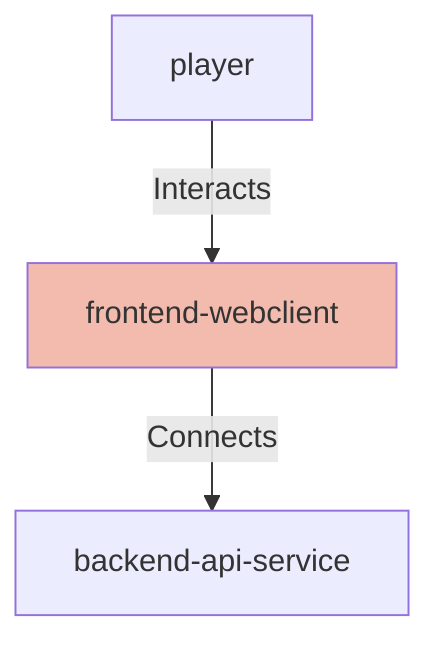

## Details

| Field               | Value                    |
|---------------------|--------------------------|
| **Unique ID**       | frontend-webclient                   |
| **Node Type**       | webclient             |
| **Name**            | Connection Solver Web Application                 |
| **Description**     | React-based web application providing the user interface for solving NYT Connections puzzles with LLM assistance          |

## Interfaces
    _No interfaces defined._

## Related Nodes

## Controls
    _No controls defined._

## Metadata
  

      <table>
          <thead>
          <tr>
              <th>Key</th>
              <th>Value</th>
          </tr>
          </thead>
          <tbody>
          <tr>
              <td>
                  <b>Technology</b>
              </td>
              <td>
                  React
                      </td>
          </tr>
          <tr>
              <td>
                  <b>Language</b>
              </td>
              <td>
                  TypeScript
                      </td>
          </tr>
          <tr>
              <td>
                  <b>Build Tool</b>
              </td>
              <td>
                  Create React App
                      </td>
          </tr>
          <tr>
              <td>
                  <b>Testing</b>
              </td>
              <td>
                  Jest, React Testing Library
                      </td>
          </tr>
          </tbody>
      </table>
  

