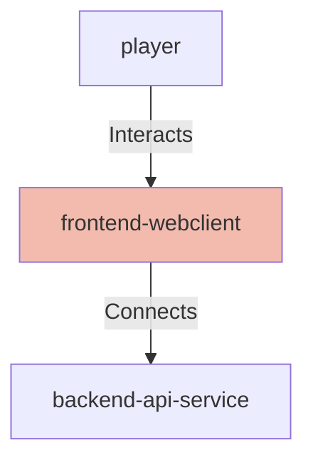

## Details

| Field               | Value                    |
|---------------------|--------------------------|
| **Unique ID**       | frontend-webclient                   |
| **Node Type**       | webclient             |
| **Name**            | Connection Solver Web Application                 |
| **Description**     | React-based web application providing the user interface for solving NYT Connections puzzles with LLM assistance          |

## Interfaces
        

            <table>
                <thead>
                <tr>
                    <th>Key</th>
                    <th>Value</th>
                </tr>
                </thead>
                <tbody>
                <tr>
                    <td>
                        <b>UniqueId</b>
                    </td>
                    <td>
                        frontend-http-interface
                            </td>
                </tr>
                <tr>
                    <td>
                        <b>AdditionalProperties</b>
                    </td>
                    <td>
                        

                            <table>
                                <thead>
                                <tr>
                                    <th>Key</th>
                                    <th>Value</th>
                                </tr>
                                </thead>
                                <tbody>
                                <tr>
                                    <td>
                                        <b>Hostname</b>
                                    </td>
                                    <td>
                                        localhost
                                            </td>
                                </tr>
                                <tr>
                                    <td>
                                        <b>Port</b>
                                    </td>
                                    <td>
                                        3000
                                            </td>
                                </tr>
                                <tr>
                                    <td>
                                        <b>Protocol</b>
                                    </td>
                                    <td>
                                        HTTP
                                            </td>
                                </tr>
                                </tbody>
                            </table>
                        

                    </td>
                </tr>
                </tbody>
            </table>
        

        

            <table>
                <thead>
                <tr>
                    <th>Key</th>
                    <th>Value</th>
                </tr>
                </thead>
                <tbody>
                <tr>
                    <td>
                        <b>UniqueId</b>
                    </td>
                    <td>
                        frontend-api-client
                            </td>
                </tr>
                <tr>
                    <td>
                        <b>AdditionalProperties</b>
                    </td>
                    <td>
                        

                            <table>
                                <thead>
                                <tr>
                                    <th>Key</th>
                                    <th>Value</th>
                                </tr>
                                </thead>
                                <tbody>
                                <tr>
                                    <td>
                                        <b>Url</b>
                                    </td>
                                    <td>
                                        http://localhost:8000
                                            </td>
                                </tr>
                                <tr>
                                    <td>
                                        <b>Timeout Ms</b>
                                    </td>
                                    <td>
                                        300000
                                            </td>
                                </tr>
                                </tbody>
                            </table>
                        

                    </td>
                </tr>
                </tbody>
            </table>
        

## Related Nodes

## Controls
    _No controls defined._

## Metadata
  

      <table>
          <thead>
          <tr>
              <th>Key</th>
              <th>Value</th>
          </tr>
          </thead>
          <tbody>
          <tr>
              <td>
                  <b>Authentication</b>
              </td>
              <td>
                  None - unauthenticated local access
                      </td>
          </tr>
          <tr>
              <td>
                  <b>Performance</b>
              </td>
              <td>
                  

                      <table>
                          <thead>
                          <tr>
                              <th>Key</th>
                              <th>Value</th>
                          </tr>
                          </thead>
                          <tbody>
                          <tr>
                              <td>
                                  <b>Initial Load</b>
                              </td>
                              <td>
                                  &lt; 2s
                                      </td>
                          </tr>
                          <tr>
                              <td>
                                  <b>Api Timeout</b>
                              </td>
                              <td>
                                  300000ms (5 minutes) for LLM requests
                                      </td>
                          </tr>
                          </tbody>
                      </table>
                  

              </td>
          </tr>
          <tr>
              <td>
                  <b>Browser Compatibility</b>
              </td>
              <td>
                  Chrome 66+, Firefox 63+, Safari 13.1+, Edge 79+
                      </td>
          </tr>
          <tr>
              <td>
                  <b>Error Handling</b>
              </td>
              <td>
                  Network errors displayed to user with retry option
                      </td>
          </tr>
          </tbody>
      </table>
  

