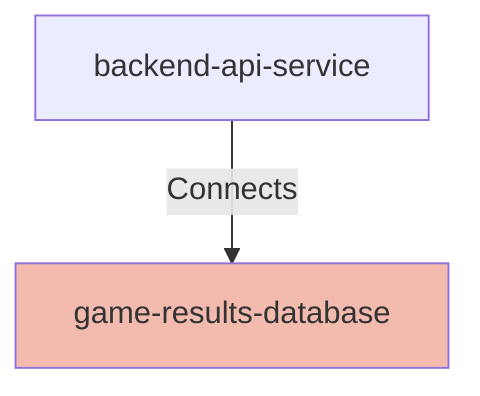

## Details

| Field               | Value                    |
|---------------------|--------------------------|
| **Unique ID**       | game-results-database                   |
| **Node Type**       | database             |
| **Name**            | Game Results SQLite Database                 |
| **Description**     | SQLite database that persists completed game sessions, including puzzle details, recommendations, player responses, and final outcomes for historical analysis          |

## Interfaces
        

            <table>
                <thead>
                <tr>
                    <th>Key</th>
                    <th>Value</th>
                </tr>
                </thead>
                <tbody>
                <tr>
                    <td>
                        <b>UniqueId</b>
                    </td>
                    <td>
                        sqlite-db-interface
                            </td>
                </tr>
                <tr>
                    <td>
                        <b>AdditionalProperties</b>
                    </td>
                    <td>
                        

                            <table>
                                <thead>
                                <tr>
                                    <th>Key</th>
                                    <th>Value</th>
                                </tr>
                                </thead>
                                <tbody>
                                <tr>
                                    <td>
                                        <b>Hostname</b>
                                    </td>
                                    <td>
                                        localhost
                                            </td>
                                </tr>
                                <tr>
                                    <td>
                                        <b>Database</b>
                                    </td>
                                    <td>
                                        puzzle_results.db
                                            </td>
                                </tr>
                                <tr>
                                    <td>
                                        <b>Protocol</b>
                                    </td>
                                    <td>
                                        JDBC
                                            </td>
                                </tr>
                                </tbody>
                            </table>
                        

                    </td>
                </tr>
                </tbody>
            </table>
        

## Related Nodes

## Controls
    _No controls defined._

## Metadata
  

      <table>
          <thead>
          <tr>
              <th>Key</th>
              <th>Value</th>
          </tr>
          </thead>
          <tbody>
          <tr>
              <td>
                  <b>Authentication</b>
              </td>
              <td>
                  None - file-based local access
                      </td>
          </tr>
          <tr>
              <td>
                  <b>Database Type</b>
              </td>
              <td>
                  SQLite 3.x
                      </td>
          </tr>
          <tr>
              <td>
                  <b>Schema Version</b>
              </td>
              <td>
                  Unknown
                      </td>
          </tr>
          <tr>
              <td>
                  <b>Tables</b>
              </td>
              <td>
                  game_results
                      </td>
          </tr>
          <tr>
              <td>
                  <b>Performance</b>
              </td>
              <td>
                  

                      <table>
                          <thead>
                          <tr>
                              <th>Key</th>
                              <th>Value</th>
                          </tr>
                          </thead>
                          <tbody>
                          <tr>
                              <td>
                                  <b>Insert Time</b>
                              </td>
                              <td>
                                  &lt; 10ms
                                      </td>
                          </tr>
                          <tr>
                              <td>
                                  <b>Query Time</b>
                              </td>
                              <td>
                                  &lt; 50ms (up to 100 records)
                                      </td>
                          </tr>
                          <tr>
                              <td>
                                  <b>Csv Export Time</b>
                              </td>
                              <td>
                                  &lt; 100ms (100 records)
                                      </td>
                          </tr>
                          </tbody>
                      </table>
                  

              </td>
          </tr>
          <tr>
              <td>
                  <b>Data Retention</b>
              </td>
              <td>
                  Unknown - no automatic cleanup
                      </td>
          </tr>
          <tr>
              <td>
                  <b>Backup Strategy</b>
              </td>
              <td>
                  Unknown
                      </td>
          </tr>
          <tr>
              <td>
                  <b>Service Ownership</b>
              </td>
              <td>
                  Unknown
                      </td>
          </tr>
          </tbody>
      </table>
  

