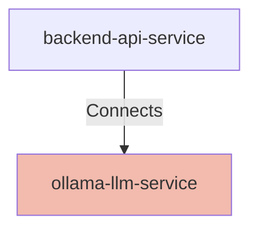

## Details

| Field               | Value                    |
|---------------------|--------------------------|
| **Unique ID**       | ollama-llm-service                   |
| **Node Type**       | service             |
| **Name**            | Ollama LLM Service                 |
| **Description**     | Local Ollama service providing open-source large language models running on the same system as the backend          |

## Interfaces
    _No interfaces defined._

## Related Nodes

## Controls
    _No controls defined._

## Metadata
  

      <table>
          <thead>
          <tr>
              <th>Key</th>
              <th>Value</th>
          </tr>
          </thead>
          <tbody>
          <tr>
              <td>
                  <b>Provider</b>
              </td>
              <td>
                  Ollama
                      </td>
          </tr>
          <tr>
              <td>
                  <b>Deployment</b>
              </td>
              <td>
                  local
                      </td>
          </tr>
          <tr>
              <td>
                  <b>Api Type</b>
              </td>
              <td>
                  REST API
                      </td>
          </tr>
          <tr>
              <td>
                  <b>Location</b>
              </td>
              <td>
                  localhost
                      </td>
          </tr>
          </tbody>
      </table>
  

