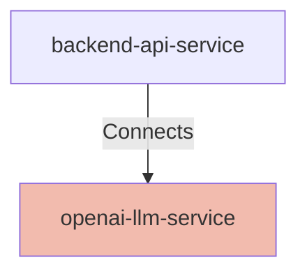

## Details

| Field               | Value                    |
|---------------------|--------------------------|
| **Unique ID**       | openai-llm-service                   |
| **Node Type**       | service             |
| **Name**            | OpenAI LLM Service                 |
| **Description**     | External OpenAI API service providing large language model capabilities for generating puzzle-solving recommendations          |

## Interfaces
        

            <table>
                <thead>
                <tr>
                    <th>Key</th>
                    <th>Value</th>
                </tr>
                </thead>
                <tbody>
                <tr>
                    <td>
                        <b>UniqueId</b>
                    </td>
                    <td>
                        openai-api-interface
                            </td>
                </tr>
                <tr>
                    <td>
                        <b>AdditionalProperties</b>
                    </td>
                    <td>
                        

                            <table>
                                <thead>
                                <tr>
                                    <th>Key</th>
                                    <th>Value</th>
                                </tr>
                                </thead>
                                <tbody>
                                <tr>
                                    <td>
                                        <b>Url</b>
                                    </td>
                                    <td>
                                        https://api.openai.com/v1
                                            </td>
                                </tr>
                                <tr>
                                    <td>
                                        <b>Protocol</b>
                                    </td>
                                    <td>
                                        HTTPS
                                            </td>
                                </tr>
                                </tbody>
                            </table>
                        

                    </td>
                </tr>
                </tbody>
            </table>
        

## Related Nodes

## Controls
    _No controls defined._

## Metadata
  

      <table>
          <thead>
          <tr>
              <th>Key</th>
              <th>Value</th>
          </tr>
          </thead>
          <tbody>
          <tr>
              <td>
                  <b>Authentication</b>
              </td>
              <td>
                  API Key (sk-* format) via OPENAI_API_KEY environment variable
                      </td>
          </tr>
          <tr>
              <td>
                  <b>Api Version</b>
              </td>
              <td>
                  v1
                      </td>
          </tr>
          <tr>
              <td>
                  <b>Default Model</b>
              </td>
              <td>
                  gpt-4o-mini
                      </td>
          </tr>
          <tr>
              <td>
                  <b>Supported Models</b>
              </td>
              <td>
                  gpt-4o-mini, gpt-4, gpt-4-turbo, gpt-4-vision-preview
                      </td>
          </tr>
          <tr>
              <td>
                  <b>Performance</b>
              </td>
              <td>
                  

                      <table>
                          <thead>
                          <tr>
                              <th>Key</th>
                              <th>Value</th>
                          </tr>
                          </thead>
                          <tbody>
                          <tr>
                              <td>
                                  <b>Typical Response Time</b>
                              </td>
                              <td>
                                  2-5 seconds
                                      </td>
                          </tr>
                          <tr>
                              <td>
                                  <b>Timeout</b>
                              </td>
                              <td>
                                  300 seconds (configurable)
                                      </td>
                          </tr>
                          <tr>
                              <td>
                                  <b>Rate Limits</b>
                              </td>
                              <td>
                                  Unknown - dependent on OpenAI account tier
                                      </td>
                          </tr>
                          </tbody>
                      </table>
                  

              </td>
          </tr>
          <tr>
              <td>
                  <b>Error Handling</b>
              </td>
              <td>
                  

                      <table>
                          <thead>
                          <tr>
                              <th>Key</th>
                              <th>Value</th>
                          </tr>
                          </thead>
                          <tbody>
                          <tr>
                              <td>
                                  <b>Invalid Api Key</b>
                              </td>
                              <td>
                                  Returns HTTP 401, mapped to HTTP 503 by backend
                                      </td>
                          </tr>
                          <tr>
                              <td>
                                  <b>Rate Limit Exceeded</b>
                              </td>
                              <td>
                                  Returns HTTP 429, mapped to HTTP 503 by backend
                                      </td>
                          </tr>
                          <tr>
                              <td>
                                  <b>Model Unavailable</b>
                              </td>
                              <td>
                                  Returns HTTP 503, propagated to client
                                      </td>
                          </tr>
                          </tbody>
                      </table>
                  

              </td>
          </tr>
          <tr>
              <td>
                  <b>Service Ownership</b>
              </td>
              <td>
                  OpenAI (external service)
                      </td>
          </tr>
          </tbody>
      </table>
  

