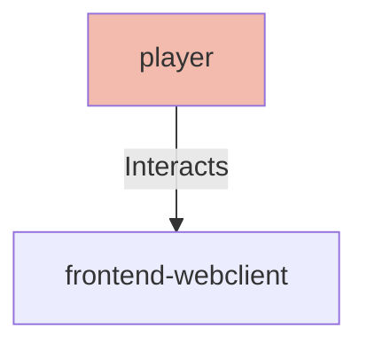

## Details

| Field               | Value                    |
|---------------------|--------------------------|
| **Unique ID**       | player                   |
| **Node Type**       | actor             |
| **Name**            | Puzzle Player                 |
| **Description**     | End user who interacts with the web application to solve NYT Connections puzzles with AI assistance          |

## Interfaces
    _No interfaces defined._

## Related Nodes

## Controls
    _No controls defined._

## Metadata
  _No Metadata defined._
