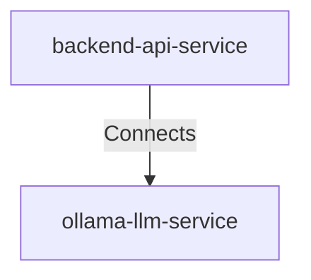

## Details

| Field               | Value                    |
|---------------------|--------------------------|
| **Unique ID**       | backend-to-ollama-connection                   |
| **Description**      |  Backend service sends local API requests to Ollama for LLM-based puzzle recommendations   |

## Related Nodes

## Controls
    _No controls defined._

## Metadata
  _No Metadata defined._
