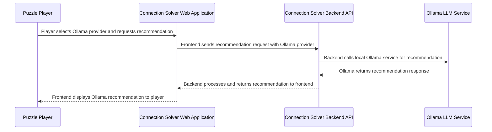

## Details

| Field               | Value                    |
|---------------------|--------------------------|
| **Unique ID**       | ollama-recommendation-flow                   |
| **Name**            | Local LLM Recommendation Process                 |
| **Description**     | User requests recommendations using local Ollama LLM service          |

## Sequence Diagram

## Controls
    _No controls defined._

## Metadata
  

      <table>
          <thead>
          <tr>
              <th>Key</th>
              <th>Value</th>
          </tr>
          </thead>
          <tbody>
          <tr>
              <td>
                  <b>Business Process</b>
              </td>
              <td>
                  Local LLM Recommendation
                      </td>
          </tr>
          <tr>
              <td>
                  <b>User Journey Step</b>
              </td>
              <td>
                  2-Get-Recommendation
                      </td>
          </tr>
          <tr>
              <td>
                  <b>Api Endpoint</b>
              </td>
              <td>
                  POST /api/v2/recommendations
                      </td>
          </tr>
          <tr>
              <td>
                  <b>Llm Provider</b>
              </td>
              <td>
                  Ollama
                      </td>
          </tr>
          <tr>
              <td>
                  <b>Deployment</b>
              </td>
              <td>
                  Local service on same host
                      </td>
          </tr>
          </tbody>
      </table>
  

