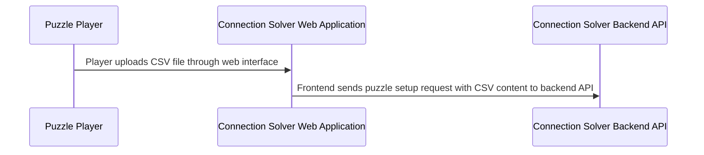

## Details

| Field               | Value                    |
|---------------------|--------------------------|
| **Unique ID**       | puzzle-setup-flow                   |
| **Name**            | Puzzle Setup Process                 |
| **Description**     | User uploads a CSV file containing 16 words to initialize a new puzzle session          |

## Sequence Diagram

## Controls
    _No controls defined._

## Metadata
  

      <table>
          <thead>
          <tr>
              <th>Key</th>
              <th>Value</th>
          </tr>
          </thead>
          <tbody>
          <tr>
              <td>
                  <b>Business Process</b>
              </td>
              <td>
                  Puzzle Initialization
                      </td>
          </tr>
          <tr>
              <td>
                  <b>User Journey Step</b>
              </td>
              <td>
                  1-Setup
                      </td>
          </tr>
          <tr>
              <td>
                  <b>Api Endpoint</b>
              </td>
              <td>
                  POST /api/puzzle/setup_puzzle
                      </td>
          </tr>
          <tr>
              <td>
                  <b>Success Criteria</b>
              </td>
              <td>
                  Session created with 16 validated words
                      </td>
          </tr>
          </tbody>
      </table>
  

