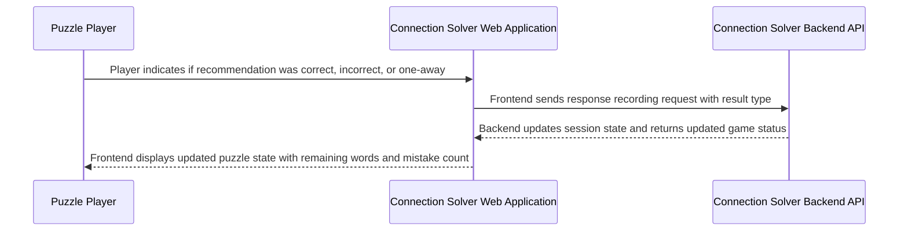

## Details

| Field               | Value                    |
|---------------------|--------------------------|
| **Unique ID**       | response-recording-flow                   |
| **Name**            | User Response Recording Process                 |
| **Description**     | User provides feedback on recommendation correctness and system updates game state          |

## Sequence Diagram

## Controls
    _No controls defined._

## Metadata
  

      <table>
          <thead>
          <tr>
              <th>Key</th>
              <th>Value</th>
          </tr>
          </thead>
          <tbody>
          <tr>
              <td>
                  <b>Business Process</b>
              </td>
              <td>
                  Response Recording
                      </td>
          </tr>
          <tr>
              <td>
                  <b>User Journey Step</b>
              </td>
              <td>
                  3-Record-Response
                      </td>
          </tr>
          <tr>
              <td>
                  <b>Api Endpoint</b>
              </td>
              <td>
                  POST /api/puzzle/record_response
                      </td>
          </tr>
          <tr>
              <td>
                  <b>State Updates</b>
              </td>
              <td>
                  remaining_words, mistake_count, game_status
                      </td>
          </tr>
          <tr>
              <td>
                  <b>Game Rules</b>
              </td>
              <td>
                  Max 4 mistakes allowed
                      </td>
          </tr>
          </tbody>
      </table>
  

