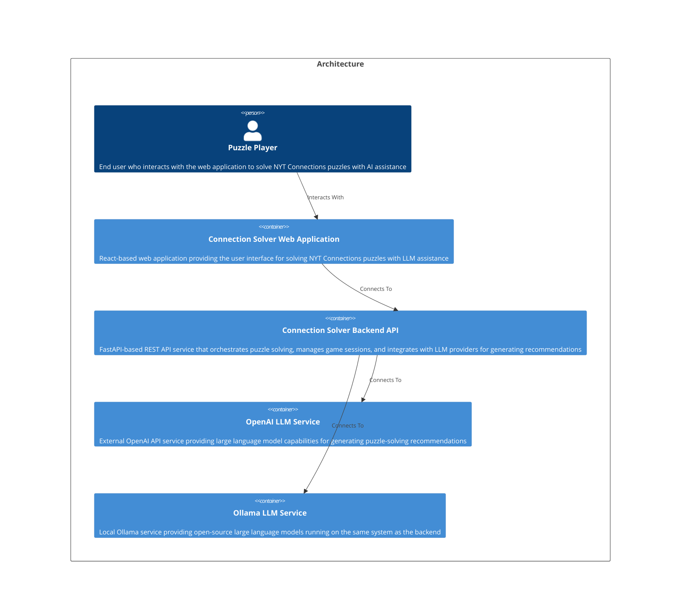

# Welcome to CALM Documentation

This documentation is generated from the **CALM Architecture-as-Code** model.

## High Level Architecture

## Nodes
    - [Puzzle Player](nodes/player)
    - [Connection Solver Web Application](nodes/frontend-webclient)
    - [Connection Solver Backend API](nodes/backend-api-service)
    - [OpenAI LLM Service](nodes/openai-llm-service)
    - [Ollama LLM Service](nodes/ollama-llm-service)

## Relationships
    - [Player Interaction](relationships/player-interaction)
    - [Frontend To Backend Connection](relationships/frontend-to-backend-connection)
    - [Backend To Openai Connection](relationships/backend-to-openai-connection)
    - [Backend To Ollama Connection](relationships/backend-to-ollama-connection)

## Flows
    - [Puzzle Setup Process](flows/puzzle-setup-flow)
    - [AI Recommendation Generation Process](flows/recommendation-generation-flow)
    - [Local LLM Recommendation Process](flows/ollama-recommendation-flow)
    - [User Response Recording Process](flows/response-recording-flow)
    - [LLM Provider Validation Process](flows/provider-validation-flow)
    - [Image-Based Puzzle Setup Process](flows/image-puzzle-setup-flow)

## Controls
  _No Controls defined._

## Metadata
  

      <table>
          <thead>
          <tr>
              <th>Key</th>
              <th>Value</th>
          </tr>
          </thead>
          <tbody>
          <tr>
              <td>
                  <b>Version</b>
              </td>
              <td>
                  1.0.0
                      </td>
          </tr>
          <tr>
              <td>
                  <b>Created By</b>
              </td>
              <td>
                  Architecture Team
                      </td>
          </tr>
          <tr>
              <td>
                  <b>Created Date</b>
              </td>
              <td>
                  2025-12-18
                      </td>
          </tr>
          <tr>
              <td>
                  <b>Environment</b>
              </td>
              <td>
                  production
                      </td>
          </tr>
          <tr>
              <td>
                  <b>Tech Stack</b>
              </td>
              <td>
                  React, TypeScript, FastAPI, Python 3.11+, LangChain
                      </td>
          </tr>
          <tr>
              <td>
                  <b>Deployment Model</b>
              </td>
              <td>
                  Full-stack web application with frontend and backend services
                      </td>
          </tr>
          </tbody>
      </table>
  

## Adrs
  _No Adrs defined._
