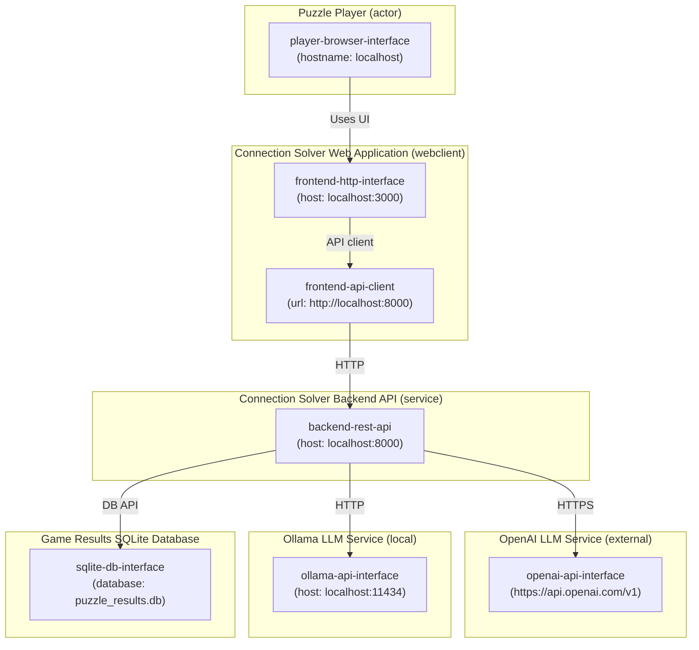

# High-level Architechure
After adding CALM Architecture JSON File to its context GHCP (gpt-5-mini) generated diagram with this prompt:

```text
generate mermaid diagram that shows the nodes and interfaces
```

Manually edited to remove extraneous items for visual clarity.

