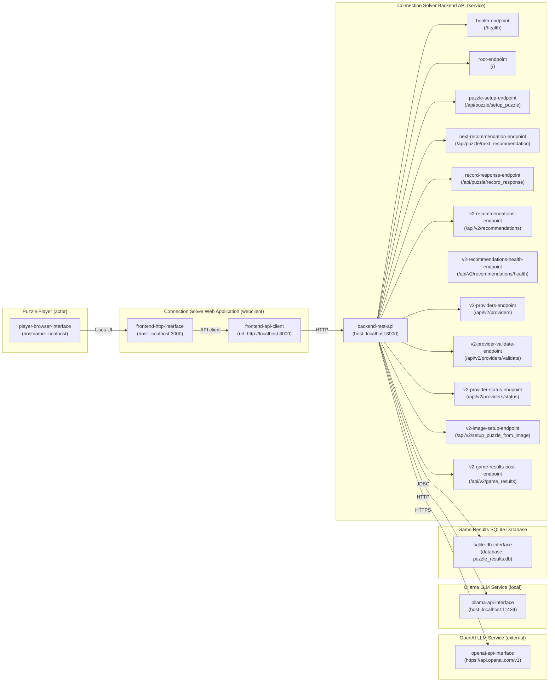

```mermaid
flowchart LR
  %% Player
  subgraph Player["Puzzle Player (actor)"]
    player_browser["player-browser-interface\n(hostname: localhost)"]
  end

  %% Frontend
  subgraph Frontend["Connection Solver Web Application (webclient)"]
    frontend_http["frontend-http-interface\n(host: localhost:3000)"]
    frontend_api_client["frontend-api-client\n(url: http://localhost:8000)"]
  end

  %% Backend
  subgraph Backend["Connection Solver Backend API (service)"]
    backend_rest["backend-rest-api\n(host: localhost:8000)"]
    health["health-endpoint\n(/health)"]
    root["root-endpoint\n(/)"]
    setup_puzzle["puzzle-setup-endpoint\n(/api/puzzle/setup_puzzle)"]
    next_rec["next-recommendation-endpoint\n(/api/puzzle/next_recommendation)"]
    record_resp["record-response-endpoint\n(/api/puzzle/record_response)"]
    v2_recs["v2-recommendations-endpoint\n(/api/v2/recommendations)"]
    v2_health["v2-recommendations-health-endpoint\n(/api/v2/recommendations/health)"]
    v2_providers["v2-providers-endpoint\n(/api/v2/providers)"]
    v2_validate["v2-provider-validate-endpoint\n(/api/v2/providers/validate)"]
    v2_status["v2-provider-status-endpoint\n(/api/v2/providers/status)"]
    v2_image["v2-image-setup-endpoint\n(/api/v2/setup_puzzle_from_image)"]
    v2_game_post["v2-game-results-post-endpoint\n(/api/v2/game_results)"]
  end

  %% OpenAI LLM
  subgraph OpenAI["OpenAI LLM Service (external)"]
    openai_api["openai-api-interface\n(https://api.openai.com/v1)"]
  end

  %% Ollama LLM
  subgraph Ollama["Ollama LLM Service (local)"]
    ollama_api["ollama-api-interface\n(host: localhost:11434)"]
  end

  %% Database
  subgraph DB["Game Results SQLite Database"]
    sqlite["sqlite-db-interface\n(database: puzzle_results.db)"]
  end

  %% Relationships / connections
  player_browser -->|Uses UI| frontend_http
  frontend_http -->|API client| frontend_api_client
  frontend_api_client -->|HTTP| backend_rest

  backend_rest -->|HTTPS| openai_api
  backend_rest -->|HTTP| ollama_api
  backend_rest -->|JDBC| sqlite

  %% Optional: show important backend endpoints connecting visually
  backend_rest --> health
  backend_rest --> root
  backend_rest --> setup_puzzle
  backend_rest --> next_rec
  backend_rest --> record_resp
  backend_rest --> v2_recs
  backend_rest --> v2_providers
  backend_rest --> v2_validate
  backend_rest --> v2_status
  backend_rest --> v2_image
  backend_rest --> v2_game_post
```