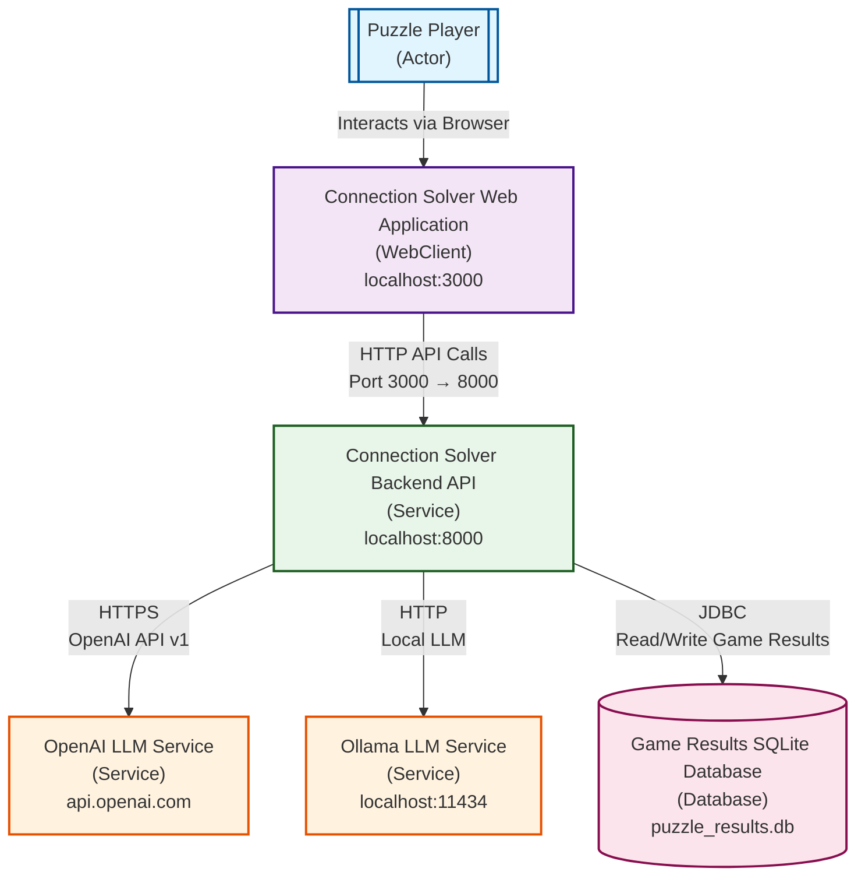
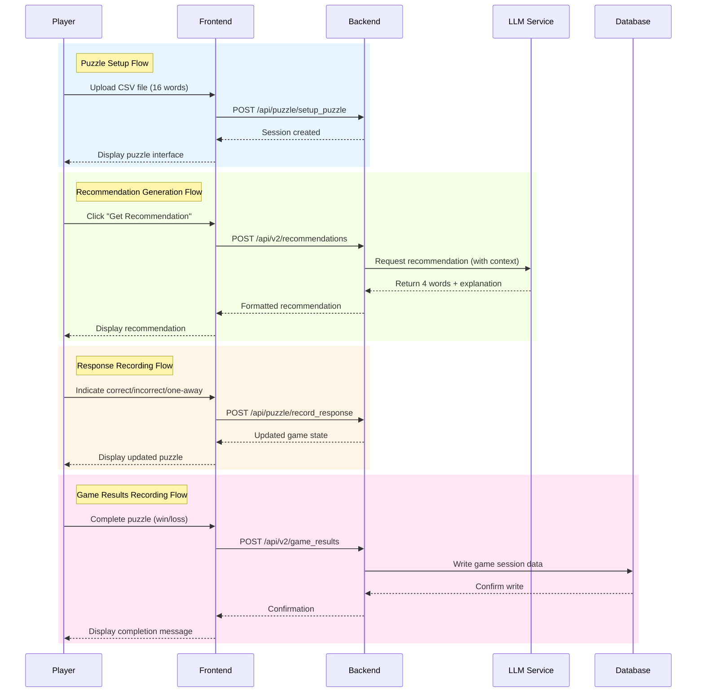

# Connection Solver Architecture Diagram

This document contains a Mermaid diagram depicting the architecture of the NYT Connections Puzzle Solver application, based on the CALM architecture specification.

## System Architecture

## Backend API Endpoints

The backend service exposes the following key endpoints:

### Health & Status
- `GET /health` - Service health check
- `GET /` - Root endpoint
- `GET /api/v2/recommendations/health` - Recommendations service health
- `GET /api/v2/providers/status` - Provider status check

### Puzzle Operations
- `POST /api/puzzle/setup_puzzle` - Initialize puzzle from CSV
- `GET /api/puzzle/next_recommendation` - Get AI recommendation (v1)
- `POST /api/puzzle/record_response` - Record player response
- `POST /api/v2/setup_puzzle_from_image` - Initialize puzzle from image

### Recommendations (v2)
- `POST /api/v2/recommendations` - Generate AI recommendation
- `GET /api/v2/recommendations/providers` - List available providers

### Provider Management (v2)
- `GET /api/v2/providers` - List LLM providers
- `POST /api/v2/providers/validate` - Validate provider configuration

### Game Results (v2)
- `POST /api/v2/game_results` - Save completed game results
- `GET /api/v2/game_results` - Retrieve game history (JSON/CSV)

## Key Flows

## Technology Stack

- **Frontend**: React 18.x, TypeScript, Create React App
- **Backend**: FastAPI, Python 3.11+, Pydantic, Uvicorn
- **LLM Integration**: LangChain, OpenAI API v1, Ollama
- **Database**: SQLite 3.x
- **Default Models**:
  - OpenAI: `gpt-4o-mini`
  - Ollama: `qwen2.5:32b`

## Performance Targets

| Operation | Target |
|-----------|--------|
| Non-LLM API Response | < 100ms |
| Simple Provider Response | < 100ms |
| OpenAI Response | 2-5 seconds |
| Ollama Response | 10-60 seconds (hardware dependent) |
| Database Insert | < 10ms |
| Database Query | < 50ms |

## Authentication & Security

- **No authentication required** - Single-user local deployment
- **API Keys**: Configured via environment variables (`OPENAI_API_KEY`)
- **CORS**: Configured for `http://localhost:3000` and `http://127.0.0.1:3000`
- **Local Access Only**: All services run on localhost

## Error Handling

- **No automatic retry** - User-initiated retry only
- **No timeout** for LLM requests - Indefinite loading indicator
- **No automatic fallback** between providers
- **All LLM failures** return HTTP 503 with error details
- **Validation errors** return HTTP 400
- **Configuration errors** return HTTP 500
