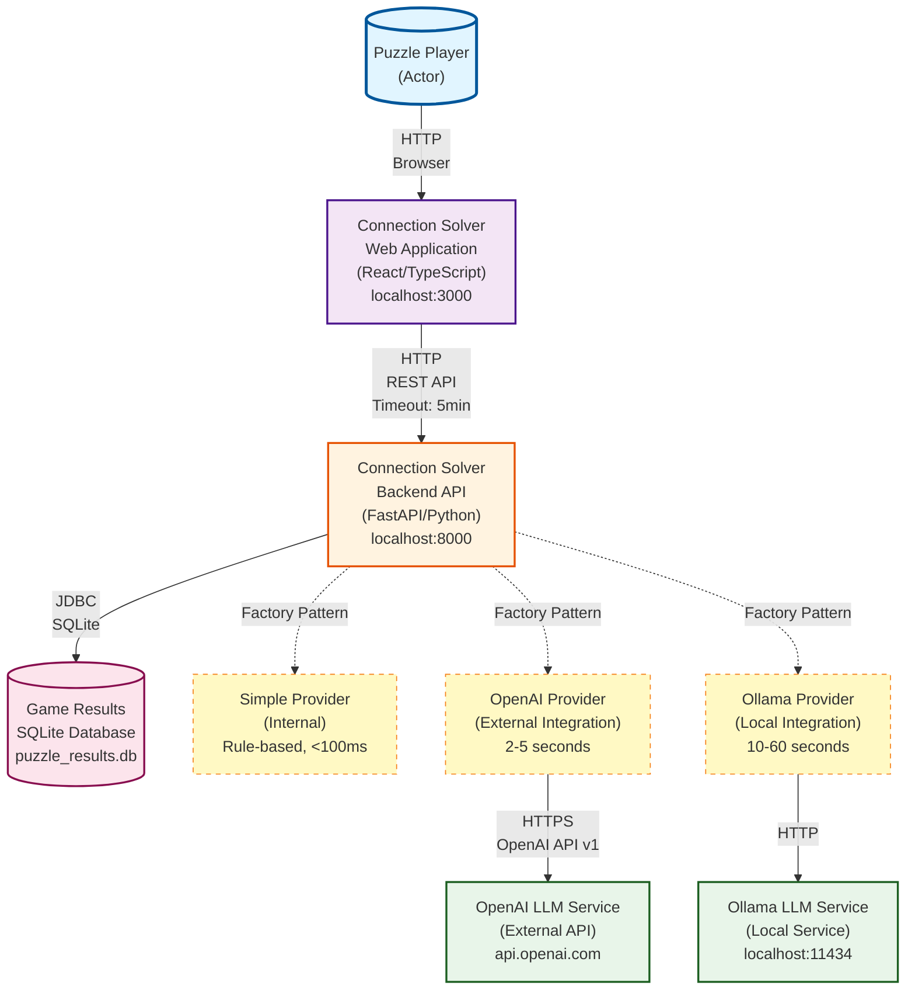
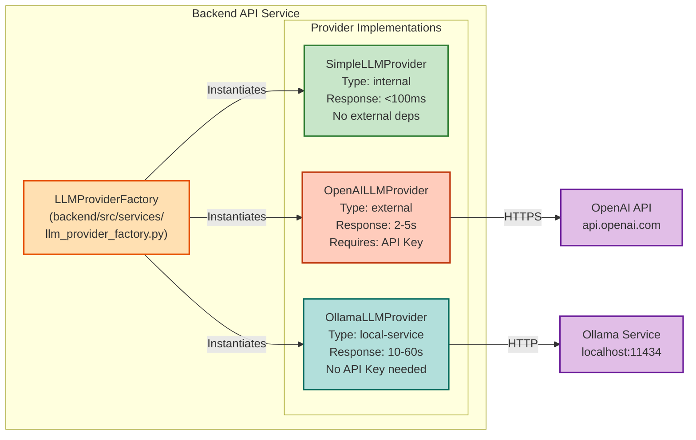
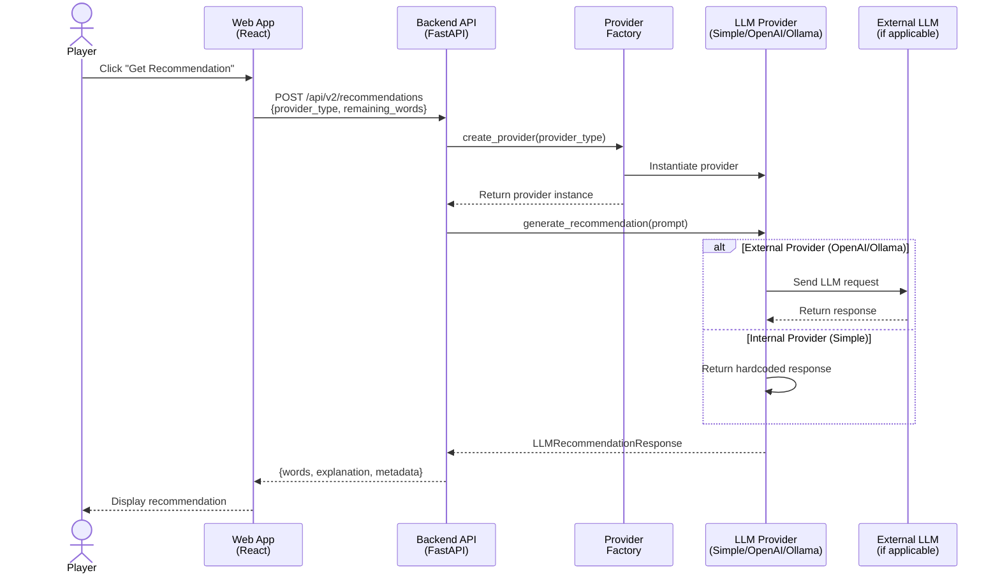
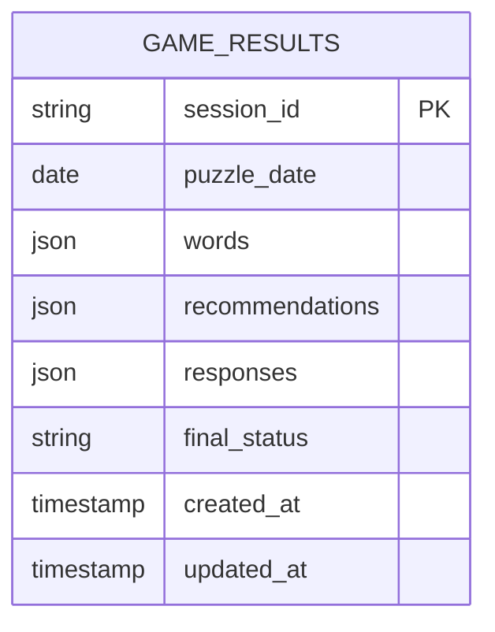

# NYT Connections Puzzle Solver Architecture

This document provides a visual representation of the system architecture based on the CALM specification, including detailed views of nodes, interfaces, and the LLM provider architecture.

## System Architecture Overview



## LLM Provider Architecture



## Provider Characteristics

| Provider | Type | Response Time | External Service | API Key | Use Case |
|----------|------|---------------|------------------|---------|----------|
| **Simple** | Internal | < 100ms | ❌ No | ❌ No | Testing, development, baseline |
| **OpenAI** | External API | 2-5 seconds | ✅ Yes | ✅ Yes | Production AI recommendations |
| **Ollama** | Local Service | 10-60 seconds | ✅ Yes (local) | ❌ No | Privacy-focused, no API costs |

### Simple Provider Details
- **Implementation**: LangChain FakeListLLM with hardcoded responses
- **Capabilities**: Basic recommendations only (no AI, no explanations)
- **Predefined Responses**:
  1. BASS, FLOUNDER, SALMON, TROUT
  2. PIANO, GUITAR, VIOLIN, DRUMS
  3. RED, BLUE, GREEN, YELLOW
  4. APPLE, BANANA, ORANGE, GRAPE


## Key API Endpoints

### Backend Service Endpoints (localhost:8000)

| Endpoint | Method | Purpose |
|----------|--------|---------|
| `/health` | GET | Health check |
| `/api/puzzle/setup_puzzle` | POST | Initialize puzzle with 16 words |
| `/api/puzzle/next_recommendation` | GET | Get next recommendation (legacy) |
| `/api/puzzle/record_response` | POST | Record player response |
| `/api/v2/recommendations` | POST | Get AI recommendation |
| `/api/v2/providers` | GET | List available providers |
| `/api/v2/providers/validate` | POST | Validate provider configuration |
| `/api/v2/providers/status` | GET | Get provider status |
| `/api/v2/setup_puzzle_from_image` | POST | Setup puzzle from image |
| `/api/v2/game_results` | POST/GET | Store/retrieve game history |

## Data Flow: Recommendation Generation



## Database Schema

### Game Results Table



## Technology Stack

| Layer | Technology | Version |
|-------|-----------|---------|
| **Frontend** | React | 18.x |
| | TypeScript | - |
| | Create React App | - |
| **Backend** | Python | 3.11+ |
| | FastAPI | - |
| | LangChain | - |
| | Uvicorn | - |
| **LLM** | OpenAI API | v1 (gpt-4o-mini) |
| | Ollama | - (qwen2.5:32b) |
| **Database** | SQLite | 3.x |

## Environment Configuration

### Required Environment Variables

```bash
# OpenAI Provider (required for OpenAI)
OPENAI_API_KEY=sk-...           # Required
OPENAI_MODEL_NAME=gpt-4o-mini   # Optional (default shown)
OPENAI_TIMEOUT=300              # Optional (seconds)

# Ollama Provider (optional)
OLLAMA_BASE_URL=http://localhost:11434  # Optional (default shown)

# Backend Configuration
BACKEND_CORS_ORIGINS=http://localhost:3000,http://127.0.0.1:3000
```

### Simple Provider
No configuration required - works out of the box for testing and development.

## Performance Targets

| Operation | Target Time |
|-----------|-------------|
| Non-LLM API Response | < 100ms |
| Simple Provider Response | < 100ms |
| OpenAI Response (typical) | 2-5 seconds |
| Ollama Response (typical) | 10-60 seconds |
| Database Insert | < 10ms |
| Database Query | < 50ms |

## Error Handling

| Error Type | HTTP Status | Description |
|------------|-------------|-------------|
| Validation Errors | 400 | Invalid request data |
| LLM Provider Errors | 503 | Provider-specific failures |
| Timeout Errors | 504 | Request timeout |
| Configuration Errors | 500 | Server configuration issues |

### Provider-Specific Errors
- **SimpleProviderError**: Internal rule-based logic failure
- **OpenAIAPIError**: OpenAI API failures (401/429/503)
- **OllamaConnectionError**: Ollama service connectivity issues

## Deployment Model

- **Type**: Full-stack web application
- **Environment**: Single-user local deployment
- **Authentication**: None required
- **Frontend**: http://localhost:3000
- **Backend**: http://localhost:8000
- **Database**: Local SQLite file (puzzle_results.db)
- **Ollama**: Local service on http://localhost:11434 (optional)
- **OpenAI**: External cloud service (optional)
