# NYT Connections Puzzle Solver Architecture

This document provides a visual representation of the system architecture based on the CALM specification, including detailed views of nodes, interfaces, and the LLM provider architecture.

## System Architecture Overview

```mermaid
graph TB
    %% Actors
    Player["Puzzle Player<br/>(Actor)"]

    %% Frontend
    Frontend["Connection Solver<br/>Web Application<br/>(React/TypeScript)<br/>localhost:3000"]

    %% Backend
    Backend["Connection Solver<br/>Backend API<br/>(FastAPI/Python)<br/>localhost:8000"]

    %% External Services
    OpenAI["OpenAI LLM Service<br/>(External API)<br/>api.openai.com"]
    Ollama["Ollama LLM Service<br/>(Local Service)<br/>localhost:11434"]

    %% Database
    Database[("Game Results<br/>SQLite Database<br/>puzzle_results.db")]

    %% LLM Providers in Backend
    SimpleProvider["Simple Provider<br/>(Internal)<br/>Rule-based, &lt;100ms"]
    OpenAIProvider["OpenAI Provider<br/>(External Integration)<br/>2-5 seconds"]
    OllamaProvider["Ollama Provider<br/>(Local Integration)<br/>10-60 seconds"]

    %% Connections
    Player -->|"HTTP<br/>Browser"| Frontend
    Frontend -->|"HTTP<br/>REST API<br/>Timeout: 5min"| Backend

    %% Backend to LLM Providers (internal)
    Backend -.->|"Factory Pattern"| SimpleProvider
    Backend -.->|"Factory Pattern"| OpenAIProvider
    Backend -.->|"Factory Pattern"| OllamaProvider

    %% Provider to External Services
    OpenAIProvider -->|"HTTPS<br/>OpenAI API v1"| OpenAI
    OllamaProvider -->|"HTTP"| Ollama

    %% Backend to Database
    Backend -->|"JDBC<br/>SQLite"| Database

    %% Styling
    classDef actor fill:lightskyblue,stroke:darkblue,stroke-width:3px
    classDef frontend fill:lavender,stroke:purple,stroke-width:2px
    classDef backend fill:wheat,stroke:darkorange,stroke-width:2px
    classDef external fill:lightgreen,stroke:darkgreen,stroke-width:2px
    classDef database fill:pink,stroke:crimson,stroke-width:2px
    classDef provider fill:lightyellow,stroke:gold,stroke-width:1px,stroke-dasharray: 5 5

    class Player actor
    class Frontend frontend
    class Backend backend
    class OpenAI,Ollama external
    class Database database
    class SimpleProvider,OpenAIProvider,OllamaProvider provider
```



## LLM Provider Architecture


## Provider Characteristics

| Provider | Type | Response Time | External Service | API Key | Use Case |
|----------|------|---------------|------------------|---------|----------|
| **Simple** | Internal | < 100ms | ❌ No | ❌ No | Testing, development, baseline |
| **OpenAI** | External API | 2-5 seconds | ✅ Yes | ✅ Yes | Production AI recommendations |
| **Ollama** | Local Service | 10-60 seconds | ✅ Yes (local) | ❌ No | Privacy-focused, no API costs |

### Simple Provider Details
- **Implementation**: LangChain FakeListLLM with hardcoded responses
- **Capabilities**: Basic recommendations only (no AI, no explanations)
- **Predefined Responses**:
  1. BASS, FLOUNDER, SALMON, TROUT
  2. PIANO, GUITAR, VIOLIN, DRUMS
  3. RED, BLUE, GREEN, YELLOW
  4. APPLE, BANANA, ORANGE, GRAPE


## Key API Endpoints

### Backend Service Endpoints (localhost:8000)

| Endpoint | Method | Purpose |
|----------|--------|---------|
| `/health` | GET | Health check |
| `/api/puzzle/setup_puzzle` | POST | Initialize puzzle with 16 words |
| `/api/puzzle/next_recommendation` | GET | Get next recommendation (legacy) |
| `/api/puzzle/record_response` | POST | Record player response |
| `/api/v2/recommendations` | POST | Get AI recommendation |
| `/api/v2/providers` | GET | List available providers |
| `/api/v2/providers/validate` | POST | Validate provider configuration |
| `/api/v2/providers/status` | GET | Get provider status |
| `/api/v2/setup_puzzle_from_image` | POST | Setup puzzle from image |
| `/api/v2/game_results` | POST/GET | Store/retrieve game history |


## Database Schema

### Game Results Table


## Technology Stack

| Layer | Technology | Version |
|-------|-----------|---------|
| **Frontend** | React | 18.x |
| | TypeScript | - |
| | Create React App | - |
| **Backend** | Python | 3.11+ |
| | FastAPI | - |
| | LangChain | - |
| | Uvicorn | - |
| **LLM** | OpenAI API | v1 (gpt-4o-mini) |
| | Ollama | - (qwen2.5:32b) |
| **Database** | SQLite | 3.x |

## Environment Configuration

### Required Environment Variables

```bash
# OpenAI Provider (required for OpenAI)
OPENAI_API_KEY=sk-...           # Required
OPENAI_MODEL_NAME=gpt-4o-mini   # Optional (default shown)
OPENAI_TIMEOUT=300              # Optional (seconds)

# Ollama Provider (optional)
OLLAMA_BASE_URL=http://localhost:11434  # Optional (default shown)

# Backend Configuration
BACKEND_CORS_ORIGINS=http://localhost:3000,http://127.0.0.1:3000
```

### Simple Provider
No configuration required - works out of the box for testing and development.

## Performance Targets

| Operation | Target Time |
|-----------|-------------|
| Non-LLM API Response | < 100ms |
| Simple Provider Response | < 100ms |
| OpenAI Response (typical) | 2-5 seconds |
| Ollama Response (typical) | 10-60 seconds |
| Database Insert | < 10ms |
| Database Query | < 50ms |

## Error Handling

| Error Type | HTTP Status | Description |
|------------|-------------|-------------|
| Validation Errors | 400 | Invalid request data |
| LLM Provider Errors | 503 | Provider-specific failures |
| Timeout Errors | 504 | Request timeout |
| Configuration Errors | 500 | Server configuration issues |

### Provider-Specific Errors
- **SimpleProviderError**: Internal rule-based logic failure
- **OpenAIAPIError**: OpenAI API failures (401/429/503)
- **OllamaConnectionError**: Ollama service connectivity issues

## Deployment Model

- **Type**: Full-stack web application
- **Environment**: Single-user local deployment
- **Authentication**: None required
- **Frontend**: http://localhost:3000
- **Backend**: http://localhost:8000
- **Database**: Local SQLite file (puzzle_results.db)
- **Ollama**: Local service on http://localhost:11434 (optional)
- **OpenAI**: External cloud service (optional)

---

## User Flows

This section details all the key user flows through the system, mapped from the CALM architecture specification.

### Flow 1: Puzzle Setup Process (CSV Upload)

**Business Process**: Puzzle Initialization
**API Endpoint**: `POST /api/puzzle/setup_puzzle`
**Success Criteria**: Session created with 16 validated words


### Flow 2: AI Recommendation Generation Process

**Business Process**: Recommendation Generation
**API Endpoints**: `GET /api/puzzle/next_recommendation`, `POST /api/v2/recommendations`
**LLM Providers**: OpenAI, Ollama, Simple
**Success Criteria**: 4 words returned with connection explanation


### Flow 3: Local LLM Recommendation Process (Ollama)

**Business Process**: Local LLM Recommendation
**API Endpoint**: `POST /api/v2/recommendations`
**LLM Provider**: Ollama
**Deployment**: Local service on same host


### Flow 4: User Response Recording Process

**Business Process**: Response Recording
**API Endpoint**: `POST /api/puzzle/record_response`
**State Updates**: `remaining_words`, `mistake_count`, `game_status`
**Game Rules**: Max 4 mistakes allowed


### Flow 5: LLM Provider Validation Process

**Business Process**: Provider Configuration
**API Endpoint**: `POST /api/v2/providers/validate`
**Validation Checks**: API key, connectivity, model availability


### Flow 6: Image-Based Puzzle Setup Process

**Business Process**: Image-Based Setup
**API Endpoint**: `POST /api/v2/setup_puzzle_from_image`
**LLM Capability**: Vision API
**Image Format**: base64-encoded, JPEG/PNG
**Success Criteria**: 16 words extracted from 4x4 grid


### Flow 7: Game Results Recording Process

**Business Process**: Game Results Persistence
**API Endpoint**: `POST /api/v2/game_results`
**Database Table**: `game_results`
**Stored Data**: session_id, puzzle_date, words, recommendations, responses, final_status, timestamps


### Flow 8: Game History Retrieval Process

**Business Process**: Game History Analysis
**API Endpoint**: `GET /api/v2/game_results`
**Export Format**: JSON, CSV (via `?format=csv` query parameter)
**Display Features**: Pagination, filtering, sorting, CSV download


## Flow Summary Table

| Flow # | Name | Primary Endpoint | User Journey Step | Key LLM Integration |
|--------|------|-----------------|-------------------|---------------------|
| 1 | Puzzle Setup (CSV) | POST /api/puzzle/setup_puzzle | 1-Setup | None |
| 2 | AI Recommendation (OpenAI) | POST /api/v2/recommendations | 2-Get-Recommendation | OpenAI API |
| 3 | AI Recommendation (Ollama) | POST /api/v2/recommendations | 2-Get-Recommendation | Ollama Local |
| 4 | Response Recording | POST /api/puzzle/record_response | 3-Record-Response | None |
| 5 | Provider Validation | POST /api/v2/providers/validate | 0-Setup | OpenAI/Ollama Health Check |
| 6 | Image-Based Setup | POST /api/v2/setup_puzzle_from_image | 1-Setup-Alternative | OpenAI Vision API |
| 7 | Game Results Recording | POST /api/v2/game_results | 4-Complete-Game | None |
| 8 | Game History Retrieval | GET /api/v2/game_results | 5-Review-History | None |
