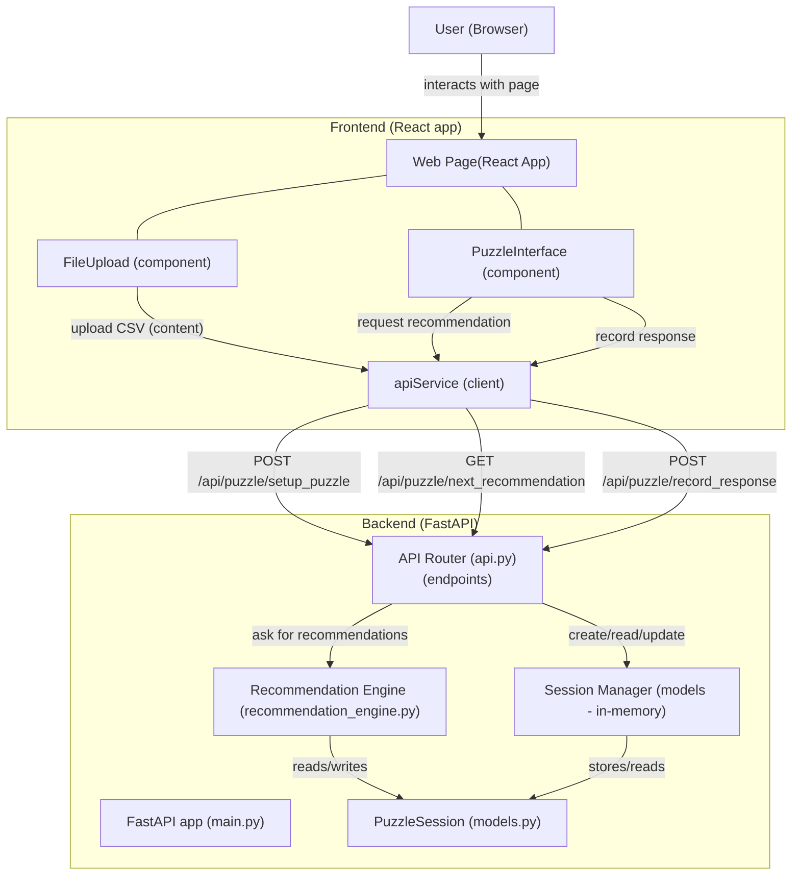

```mermaid
flowchart TB
  %% User and browser
  User["User (Browser)"]

  %% Frontend subgraph
  subgraph Frontend ["Frontend (React app)"]
    BrowserPage["Web Page(React App)"]
    FileUpload["FileUpload (component)"]
    PuzzleInterface["PuzzleInterface (component)"]
    APIService["apiService (client)"]
  end

  %% Backend subgraph
  subgraph Backend ["Backend (FastAPI)"]
    FastAPIApp["FastAPI app (main.py)"]
    APIRouter["API Router (api.py)\n(endpoints)"]
    RecEngine["Recommendation Engine (recommendation_engine.py)"]
    SessionMgr["Session Manager (models - in-memory)"]
    Models["PuzzleSession (models.py)"]
  end

  %% Network
  BrowserPage --- FileUpload
  BrowserPage --- PuzzleInterface
  FileUpload -->|"upload CSV (content)"| APIService
  PuzzleInterface -->|request recommendation| APIService
  PuzzleInterface -->|record response| APIService

  APIService -->|POST /api/puzzle/setup_puzzle| APIRouter
  APIService -->|GET /api/puzzle/next_recommendation| APIRouter
  APIService -->|POST /api/puzzle/record_response| APIRouter

  APIRouter -->|create/read/update| SessionMgr
  APIRouter -->|ask for recommendations| RecEngine
  RecEngine -->|reads/writes| Models
  SessionMgr -->|stores/reads| Models

 

  %% User interaction flow
  User -->|interacts with page| BrowserPage
 
```
