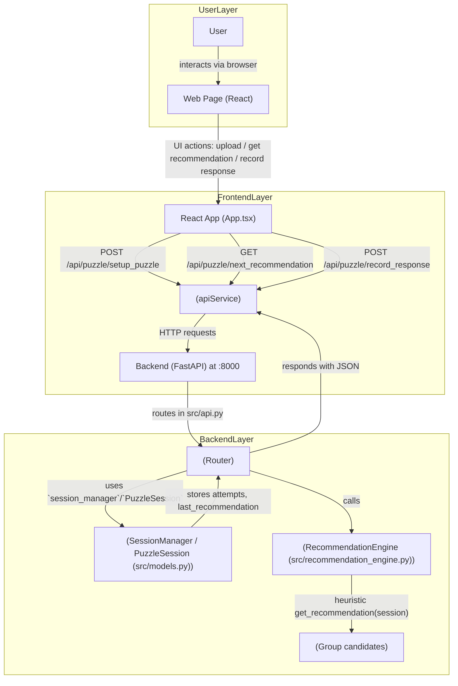

```mermaid
flowchart TB
  subgraph UserLayer
    U[User] -->|interacts via browser| Browser["Web Page (React)"]
  end

  subgraph FrontendLayer
    Browser -->|UI actions: upload / get recommendation / record response| FrontendApp["React App (App.tsx)"]
    FrontendApp -->|POST /api/puzzle/setup_puzzle| FrontendAPI["(apiService)"]
    FrontendApp -->|GET /api/puzzle/next_recommendation| FrontendAPI
    FrontendApp -->|POST /api/puzzle/record_response| FrontendAPI
    FrontendAPI -->|HTTP requests| BackendAPI["Backend (FastAPI) at :8000"]
  end

  subgraph BackendLayer
    BackendAPI -->|routes in src/api.py| Router["(Router)"]
    Router -->|uses `session_manager`/`PuzzleSession`| SessionManager["(SessionManager / PuzzleSession (src/models.py))"]
    Router -->|calls| RecEngine["(RecommendationEngine (src/recommendation_engine.py))"]
    RecEngine -->|"heuristic get_recommendation(session)"| Groups["(Group candidates)"]
    SessionManager -->|stores attempts, last_recommendation| Router
    Router -->|responds with JSON| FrontendAPI
  end

 
```
